# تدقيق Supabase / PostgreSQL الشامل

## جدول المحتويات

1. [نطاق التدقيق ومصادر الأدلة](#نطاق-التدقيق-ومصادر-الأدلة)
2. [Executive Summary](#executive-summary)
3. [التحقق الحاسم من خطر `handle_new_user`](#التحقق-الحاسم-من-خطر-handle_new_user)
4. [Fatal Issues](#fatal-issues)
5. [High Risk Issues](#high-risk-issues)
6. [Medium Risk Issues](#medium-risk-issues)
7. [Low Risk Issues](#low-risk-issues)
8. [Database Inventory](#database-inventory)
9. [تصنيف الجداول بلا `school_id`](#تصنيف-الجداول-بلا-school_id)
10. [ERD / Database Relationship Map](#erd--database-relationship-map)
11. [Trigger Map](#trigger-map)
12. [Function / RPC Audit](#function--rpc-audit)
13. [RLS Matrix: Who Sees What](#rls-matrix-who-sees-what)
14. [Dead Tables / Blind Code / Orphaned Architecture](#dead-tables--blind-code--orphaned-architecture)
15. [Live DB vs Local Migrations Diff](#live-db-vs-local-migrations-diff)
16. [Security Checklist](#security-checklist)
17. [Performance / Index Audit](#performance--index-audit)
18. [Recommended Fix Plan](#recommended-fix-plan)
19. [Validation SQL / Commands](#validation-sql--commands)
20. [المراجع](#المراجع)

## نطاق التدقيق ومصادر الأدلة

هذا التقرير قراءة فقط. لم يتم تعديل أي كائن في قاعدة البيانات، ولم يتم تطبيق migrations، ولم يتم تنفيذ `DROP`, `ALTER`, `DELETE`, `TRUNCATE`, أو policy changes.

مصادر التدقيق:

- live Supabase project: `ciwqgskyqtnciexfcgrr`
- local source of truth: `db/migrations/`
- local Supabase config: `supabase/`
- app code: `app/`, `lib/`
- auth/db services: `lib/auth/`, `lib/db/`
- PBAC/roles: `lib/auth/pbac.ts`, `lib/auth/roles.ts`
- live catalogs: `pg_catalog`, `information_schema`, `pg_policies`, `pg_proc`, `pg_trigger`, `pg_constraint`, `pg_index`, `storage.buckets`, `cron.job`
- Supabase advisors: security + performance

حقائق مثبتة:

- المشروع المحلي مرتبط بـ`project_ref = ciwqgskyqtnciexfcgrr`.
- `db/migrations/` يحتوي 80 ملف SQL إضافة إلى ملفات verify.
- سجل migrations الحي يحتوي ترحيلين فقط:
  - `20260531155306 m75_gamification_multitenant`
  - `20260531160808 20260602_pg_cron_daily_feed`
- `public` الحي يحتوي 110 جداول.
- RLS مفعّل على كل جداول `public`.
- 10 جداول `public` تحتوي `school_id` لكنه nullable.
- 10 جداول `public` لا تحتوي `school_id`.
- live Edge Functions فارغة.
- local Edge Function موجودة: `supabase/functions/daily-feed/index.ts`.
- `cron.job` يحتوي `daily-analytics-feed` مفعلاً، لكن `app.cron_site_url` و`app.cron_secret` غير مضبوطين.

## Executive Summary

قاعدة البيانات غير جاهزة للإطلاق.

التقييم:

- الصحة البنيوية: ضعيفة إلى متوسطة. الجداول كثيرة ومقسمة وظيفياً، لكن migration history غير موثوق، ويوجد drift واضح بين local migrations والـlive DB.
- عزل tenant: غير آمن بما يكفي. وجود RLS لا يعوض وجود tenant tables بلا `school_id` أو بـ`school_id nullable`.
- اكتمال RLS: RLS مفعّل على 110/110 من جداول `public`، لكنه غير كافٍ بسبب سياسات غامضة، `USING (true)`, و`SECURITY DEFINER` مكشوفة عبر API.
- مخاطر الإطلاق: توجد مخاطر Fatal مؤكدة تمنع signup/onboarding وruntime paths وRPCs.
- readiness level: `35/100`.

الخلاصة التنفيذية:

- لا يجوز إطلاق النظام قبل إصلاح `auth.users` trigger، توحيد migration history، إغلاق RPC surface، وإجبار `school_id NOT NULL` على كل tenant table.
- `system_owner` bypass موجود جزئياً، لكنه غير موثق بالكامل ولا يكفي لتبرير `SECURITY DEFINER` callable من `anon/authenticated`.
- البنية مناسبة لإعادة بناء ما قبل الإطلاق، لا لصيانة Patch صغيرة.

## التحقق الحاسم من خطر `handle_new_user`

### 1. Trigger Name

```sql
CREATE TRIGGER on_auth_user_created
AFTER INSERT ON auth.users
FOR EACH ROW
EXECUTE FUNCTION handle_new_user()
```

- trigger name: `on_auth_user_created`
- trigger table: `auth.users`
- trigger function: `public.handle_new_user()`

### 2. Trigger Function Body / Relevant Excerpt

النص الحي للدالة:

```sql
CREATE OR REPLACE FUNCTION public.handle_new_user()
RETURNS trigger
LANGUAGE plpgsql
SECURITY DEFINER
SET search_path TO 'public'
AS $function$
BEGIN
INSERT INTO public.profiles (
        id,
        email,
        full_name,
        role,
        created_at
    )
VALUES (
        NEW.id,
        NEW.email,
        COALESCE(NEW.raw_user_meta_data->>'full_name', ''),
        'teacher',
        NOW()
    ) ON CONFLICT (id) DO NOTHING;
RETURN NEW;
END;
$function$
```

الدليل المباشر: الدالة تكتب إلى `public.profiles.role`.

### 3. Live `profiles` Columns

أعمدة `public.profiles` الحية:

```text
id uuid NOT NULL
email text
full_name text
created_at timestamptz DEFAULT now()
updated_at timestamptz
mobile_number text
is_onboarded boolean DEFAULT false
job_title text
system_role system_role_type NOT NULL DEFAULT 'system_user'
default_persona_id uuid
```

العمود `role` غير موجود. الموجود الصحيح حالياً:

- `profiles.system_role` للدور النظامي العام.
- `user_personas.role` للأدوار المدرسية المرتبطة بـ`school_id`.

### 4. Exact Expected Failure

تم إثبات الخطأ عبر `EXPLAIN` بدون `ANALYZE` على نفس جملة `INSERT`. هذا لا يكتب بيانات.

```sql
explain (verbose, costs off)
insert into public.profiles (id, email, full_name, role, created_at)
values ('00000000-0000-0000-0000-000000000001'::uuid, 'x@example.invalid', 'X', 'teacher', now())
on conflict (id) do nothing;
```

الخطأ:

```text
ERROR: 42703: column "role" of relation "profiles" does not exist
LINE 2: insert into public.profiles (id, email, full_name, role, created_at)
                                                           ^
```

الأثر المتوقع:

- عند `INSERT` جديد في `auth.users`، trigger `on_auth_user_created` يعمل بعد الإدخال.
- فشل `public.handle_new_user()` يفشل transaction.
- النتيجة العملية: signup أو onboarding عبر Supabase Auth يفشل بخطأ database.
- رسالة Supabase Auth الخارجية النهائية غير مؤكدة لأنها تعتمد على طبقة Auth API، لكن خطأ PostgreSQL نفسه مؤكد.

### 5. Correct Architectural Fix Options

الخيار المعماري الموصى به:

- إعادة بناء `public.handle_new_user()` ليُنشئ skeleton فقط في `public.profiles`:
  - `id`
  - `email`
  - `full_name`
  - `created_at`
- عدم كتابة أي school role داخل trigger.
- عدم تعيين default role مثل `'teacher'`.
- تخزين الأدوار المدرسية فقط في `public.user_personas`.
- تخزين الدور النظامي فقط في `public.profiles.system_role`.
- تحديث JWT `app_metadata` عبر مسار موثوق بعد قبول الدعوة أو اختيار persona.

خيار بديل أكثر صرامة:

- حذف trigger بالكامل.
- جعل مسار قبول الدعوة server action أو RPC موثوقاً ينشئ:
  - `profiles`
  - `user_personas`
  - `profiles.default_persona_id`
  - `auth.users.app_metadata`
- هذا مناسب جداً قبل الإطلاق لأنه لا توجد بيانات إنتاجية.

ما لا يجب فعله:

- لا تعيد إنشاء `profiles.role`.
- لا تجعل `role` nullable للتوافق.
- لا تضع `school_id` داخل `profiles` كحل بديل للأدوار المدرسية.

## Fatal Issues

| التصنيف | المشكلة | الدليل | السبب الجذري | الأثر | الإصلاح الموصى به | نوع التغيير | يمنع الإطلاق |
|---|---|---|---|---|---|---|---|
| Fatal | إنشاء المستخدمين مكسور | `auth.users.on_auth_user_created -> public.handle_new_user()` يكتب `profiles.role`، والعمود غير موجود | legacy auth provisioning لم يُحدث بعد إزالة `profiles.role` | signup/onboarding يفشل | إعادة بناء auth provisioning حول `profiles + user_personas + app_metadata` | migration + app | نعم |
| Fatal | تحديث `profiles` مكسور | trigger `public.profiles.enforce_privileged_fields_immutability -> public.block_privileged_field_changes()` يقارن `NEW.role/OLD.role` | trigger function قديمة بعد حذف `profiles.role` | أي update على `profiles` قد يفشل | إعادة كتابة trigger حول `system_role/default_persona_id` أو حذف المنطق القديم | migration | نعم |
| Fatal | migration history غير موثوق | live migrations = 2، local migrations = 80 | DB مطبقة أو معدلة خارج سجل migrations | لا يمكن إثبات أن live DB مطابق للمصدر الرسمي | reset pre-launch أو baseline migration موحد ثم apply بالترتيب | migration process | نعم |
| Fatal | RPC transaction layer مكسور | `public.rpc_process_transaction(...)` يقرأ `public.system_config` غير الموجود | gamification ledger refactor غير مكتمل | RPC يفشل runtime وقد يتجاوز RLS لأنه `SECURITY DEFINER` | إعادة بناء ledger RPCs tenant-scoped أو حذف القديمة | migration + app | نعم |
| Fatal | RPC overloads خطرة | `rpc_scan_ar_glyph(text)`, `rpc_purchase_furniture(uuid)` legacy، والجديدة callable من `anon` | revokes غير مطابقة للـlive أو default grants | mutation surface مكشوف ومختلط tenant | حذف overloads القديمة، revoke `anon`, explicit grants فقط | migration | نعم |
| Fatal | Tenant invariant مكسور | 10 جداول فيها `school_id nullable` | مراحل انتقالية أو defaults قديمة | orphan/cross-tenant rows ممكنة | `school_id uuid NOT NULL` على كل tenant table | migration | نعم |
| Fatal | app references لجداول محذوفة | `app/secretary/_actions.ts`, `app/classroom/_actions.ts`, `lib/rate-limiter.ts`, `app/principal/analytics/...` | حذف legacy tables دون تحديث app | runtime failures في صفحات وأكشنز | تحديث app إلى الجداول الجديدة أو إنشاء الجداول المقصودة | app + migration | نعم |

## High Risk Issues

| المشكلة | الدليل | لماذا مهم | الإصلاح |
|---|---|---|---|
| `SECURITY DEFINER` callable من `authenticated` | advisor 0029: `get_my_role`, `get_my_school_id`, `is_system_owner`, `rpc_process_transaction`, RPC overloads | `SECURITY DEFINER` يتجاوز RLS وقد يسرّب أو يغيّر بيانات | move to private schema أو revoke execute أو `SECURITY INVOKER` |
| `SECURITY DEFINER` callable من `anon` | advisor 0028: `rpc_scan_ar_glyph(text, uuid)`, `rpc_purchase_furniture(uuid, uuid)` | anonymous mutation risk | revoke `anon`, revoke `PUBLIC`, explicit grants |
| `workflow_definitions` تستخدم `USING (true)` | policy `wfd_select_authenticated` | مقبول فقط لو global catalog مثبت | توثيق الاستثناء أو تضييقه |
| enum legacy `user_role` حي | `user_role` يحتوي `principal`, `super_admin`, وغيرها | يخالف official roles | drop enum بعد إزالة الاعتماد عليه |
| `student_honors` و`student_wishes` بلا `school_id` | FK إلى `student_profiles`, policies `student_id = auth.uid()` | tenant leakage + policy identity bug | إضافة `school_id`, تصحيح policies |
| `case_actions` بلا `school_id` | FK إلى `cases`, no direct tenant column | يعتمد على RLS غير مباشر | إضافة `school_id` وcomposite constraints |
| GraphQL exposure واسع | advisor 0027 لكثير من الجداول | اكتشاف metadata وجداول حساسة لكل authenticated | revoke broad table grants أو تعطيل GraphQL حسب الحاجة |
| `pg_net` في `public` | advisor 0014 | extension في exposed schema | نقل extension إلى schema غير مكشوف |
| Auth leaked password protection disabled | security advisor | ضعف إعدادات Auth قبل الإطلاق | تفعيل leaked password protection |

## Medium Risk Issues

| المشكلة | الدليل | الأثر | الإصلاح |
|---|---|---|---|
| 125 FK بلا covering index | performance advisor + direct catalog query | بطء joins/deletes/RLS checks | إضافة indexes مدروسة |
| 13 tenant tables بلا leftmost `school_id` index | catalog query | RLS predicates ستكون أبطأ | index يبدأ بـ`school_id` |
| duplicate index على `student_profiles(national_id)` | `idx_student_profiles_national_id`, `idx_students_national_id` | write overhead | حذف أحدهما في migration لاحق |
| multiple permissive policies | advisor 0006 | overhead وارتباك RLS | دمج policies المتشابهة |
| `cron.job` active لكن secrets مفقودة | `daily-analytics-feed`, settings null | no-op أو فشل silent | ضبط secrets أو تعطيل حتى deploy |
| local Edge Function غير deployed | live Edge Functions = `[]`, local `daily-feed` موجودة | automation drift | deploy أو حذف local intent |
| app route inconsistencies | `activity_leader` map: `/activity` vs `/activities` | route confusion | توحيد route contracts |

## Low Risk Issues

| المشكلة | الدليل | الإصلاح |
|---|---|---|
| `z_archive.import_runs` و`z_archive.import_run_items` RLS enabled بلا policies | security advisor info | إما archive locked schema أو explicit admin policies |
| `z_archive.qa_rubrics` RLS disabled | live catalog | إن كان archive غير مكشوف وثابت فوثّق؛ وإلا فعّل RLS |
| naming legacy في migrations القديمة | local migrations تحتوي references لـ`vp_students`, `principal`, `school_coordinator`, `super_admin` | تنظيف baseline قبل الإطلاق |
| docs تحتاج مصدر حقيقة واحد | `db/README.md` جيد لكنه لا يعكس live drift بالكامل | تحديث بعد cleanup النهائي |

## Database Inventory

### ملخص رقمي

| schema | tables | RLS disabled | `school_id nullable` | no `school_id` | RLS enabled no policy |
|---|---:|---:|---:|---:|---:|
| `public` | 110 | 0 | 10 | 10 | 0 |
| `z_archive` | 5 | 1 | 0 | 4 | 2 |

### جداول `school_id nullable`

هذه الجداول tenant tables أو operational tables ويجب ألا يبقى `school_id` فيها nullable:

```text
academic_years
action_audit_log
activity_clubs
activity_events
activity_financials
classes
counseling_sessions
events
student_profiles
user_personas
```

### خريطة الجداول حسب الدومين

| الدومين | الجداول | التصنيف | حالة `school_id` | RLS / Policies | الحالة |
|---|---|---|---|---|---|
| Core/Auth | `schools`, `profiles`, `user_personas`, `invites`, `action_idempotency`, `action_audit_log` | mixed global/tenant | `user_personas*`, `action_audit_log*`, `invites!`, `action_idempotency!` | enabled | active مع fatal drift |
| Academic | `academic_years`, `school_stages`, `terms`, `periods`, `subjects`, `classes`, `timetable_slots`, `teacher_assignments`, `student_enrollments` | tenant | `academic_years*`, `classes*` | enabled | active، يحتاج NOT NULL |
| Students/Parents | `student_profiles`, `guardians`, `student_guardians`, `parent_notes`, `parent_reports`, `student_honors`, `student_wishes` | tenant | `student_profiles*`, `student_honors!`, `student_wishes!` | enabled | active/suspicious |
| Attendance/Behavior | `attendance_scans`, `student_daily_attendance`, `period_attendance`, `behavioral_referrals`, `behavioral_contracts`, `cases`, `case_actions`, `counseling_sessions`, `counselor_sessions`, `classroom_exits`, `student_assets` | tenant | `case_actions!`, `counseling_sessions*` | enabled | active مع gaps |
| Staff/HR | `staff_attendance_logs`, `biometric_logs`, `hr_accountability_tickets`, `staff_evaluations`, `employee_leaves` | tenant | NOT NULL | enabled | active |
| Workflows/Meetings | `workflow_definitions`, `workflow_instances`, `workflow_transitions`, `approval_gates`, `generated_forms`, `wizard_sessions`, `bulk_upload_jobs`, `meeting_sessions`, `meeting_session_attendees`, `meeting_live_notes`, `meeting_action_items`, `nonconformance_reports` | definitions global، الباقي tenant | `workflow_definitions!` | enabled | active، `USING(true)` needs review |
| LRC | `lrc_books`, `lrc_loans`, `lrc_visits`, `lrc_visit_attendance`, `lrc_bookings` | tenant | NOT NULL | enabled | active |
| Health | `health_visits`, `health_referrals`, `health_awareness`, `health_supplies`, `hygiene_logs`, `canteen_checks` | tenant | NOT NULL | enabled | active |
| QA/Quality | `qa_observations`, `qa_kpis_daily`, `qa_rubrics`, `quality_indicators`, `quality_evidence`, `interventions`, `student_risk_flags` | tenant | NOT NULL | enabled | active |
| Activities/Events | `activity_clubs`, `activity_events`, `activity_financials`, `activity_trips`, `trip_consents`, `club_assignments`, `club_evaluations`, `events`, `secretary_correspondence` | tenant | `activity_clubs*`, `activity_events*`, `activity_financials*`, `events*` | enabled | active مع nullable |
| Notifications/Automation | `notifications`, `notification_queue`, `automation_rules` | tenant | NOT NULL | enabled | active |
| Analytics/AI | `daily_kpis`, `class_weekly_summary`, `student_analytics_cache`, `ai_prompt_templates`, `ai_insights` | mixed | `ai_prompt_templates!` global catalog | enabled | active |
| Science/Lab | `lab_inventory`, `lab_bookings`, `lab_experiments` | tenant | NOT NULL | enabled | active |
| Classroom | `classroom_metadata`, `gradebook_items` | tenant | NOT NULL | enabled | active |
| Gamification | `student_wallet`, `transaction_logs`, `sentinel_flags`, `seasons`, `quest_nodes`, `quest_progress`, `marketplace_items`, `inventory`, `raid_bosses`, `streaks`, `loot_chests`, `corruption_states`, `phantom_merchant_sessions`, `auctions`, `ar_glyphs`, `student_glyph_finds`, `student_dorms`, `dorm_furniture`, `hall_of_legends` | tenant | NOT NULL | enabled | active لكن RPC surface خطر |
| Archive | `z_archive.action_idempotency`, `z_archive.import_runs`, `z_archive.import_run_items`, `z_archive.qa_rubrics`, `z_archive.role_audit_logs` | archive | mixed | mixed | needs documentation/lockdown |

Legend:

- `*` = `school_id` موجود لكنه nullable.
- `!` = لا يوجد `school_id`.
- global catalog = مقبول فقط إذا وثق كاستثناء معماري.

## تصنيف الجداول بلا `school_id`

| table | الحكم | الدليل الحي | app usage | القرار |
|---|---|---|---|---|
| `schools` | global صحيح | root tenant table، PK `id` | `lib/dashboard-data.ts`, `app/api/admin/schools/route.ts` | لا يحتاج `school_id` |
| `profiles` | global صحيح | identity root، يحتوي `system_role`, `default_persona_id` | `app/api/persona/select/route.ts`, `app/_context/AuthContext.tsx` | لا يحتاج `school_id`، لكن triggers قديمة |
| `reason_codes_catalog` | global catalog غالباً | `category`, `code`, `label_ar`, `iso_clause`, `is_active` | `lib/services/wizard-service.ts` | مقبول إذا catalog مركزي |
| `ai_prompt_templates` | global catalog غالباً | `role_target`, `context_type`, `template_text`, system_owner writes | `lib/services/ai-service.ts` | مقبول إذا templates مركزية |
| `workflow_definitions` | global catalog محتمل | `workflow_code`, `states`, `required_roles`; policy `USING true` | `lib/workflow-service.ts`, `app/workflows/[id]/page.tsx` | يحتاج توثيق أو تضييق |
| `action_idempotency` | user-scoped infra، ليس global حقيقياً | `user_id`, `idempotency_key`, unique `(user_id, idempotency_key)` | `lib/safe-action.ts` | أضف `school_id` أو `persona_id` للعمليات tenant-scoped |
| `invites` | tenant table بلا `school_id` قياسي | `target_school_id uuid NOT NULL`, `target_role user_role` | `app/_actions/invite.ts`, `app/_actions/staff.ts` | وحّد إلى `school_id`, استبدل `user_role` |
| `case_actions` | tenant child table ناقص | FK إلى `cases(id)` و`profiles(id)` فقط | `app/counselor/_hooks/useCounselor.ts` | أضف `school_id NOT NULL` وcomposite FK/check |
| `student_honors` | tenant table ناقص وخطر | FK `student_id -> student_profiles(id)`, policy `student_id = auth.uid()` | `app/activity/_actions.ts`, `app/activity/_hooks/useActivities.ts` | أضف `school_id`, صحح RLS, أضف insert policy |
| `student_wishes` | tenant table ناقص وخطر | FK إلى `student_profiles` و`activity_clubs`, policy `student_id = auth.uid()` | `app/activity/_actions.ts`, `app/activity/_hooks/useActivities.ts` | أضف `school_id`, صحح RLS, أضف upsert policies |

نتيجة التصنيف:

- global مبرر: `schools`, `profiles`.
- global catalog محتمل: `reason_codes_catalog`, `ai_prompt_templates`, `workflow_definitions`.
- يحتاج tenant context: `action_idempotency`.
- tenant tables ناقصة `school_id`: `invites`, `case_actions`, `student_honors`, `student_wishes`.

## ERD / Database Relationship Map

### Core Tenancy / Auth / Personas

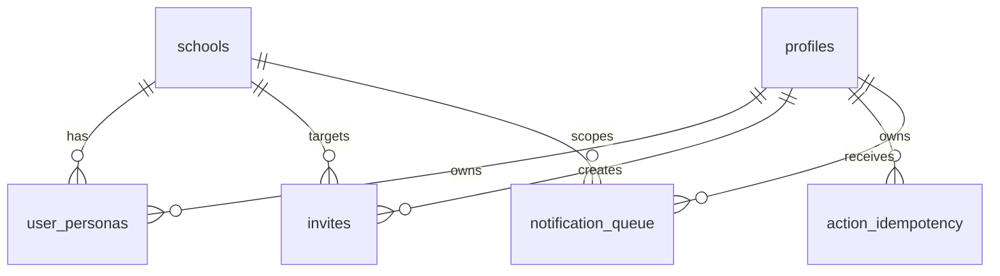

### Academic Structure

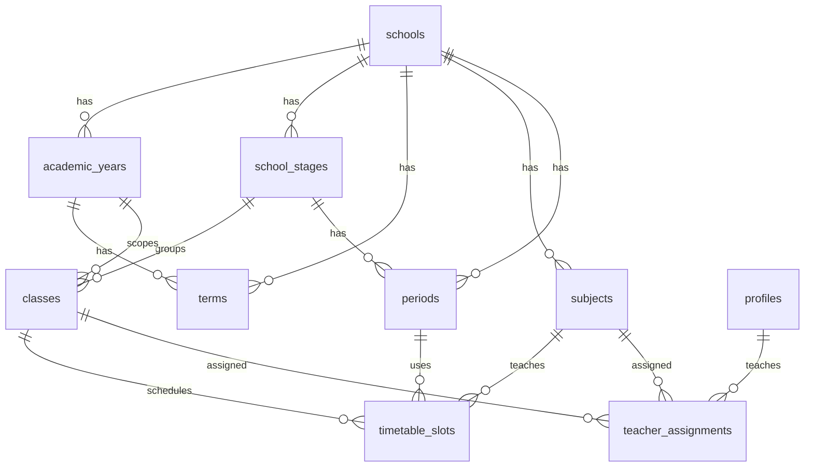

### Students / Parents

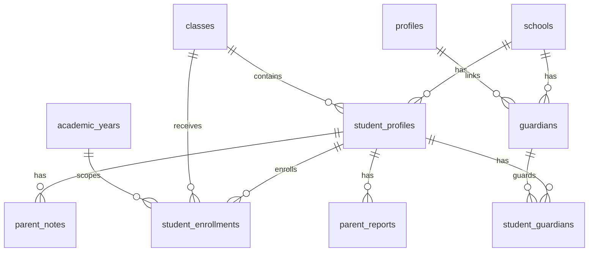

### Attendance / Behavior / Counseling

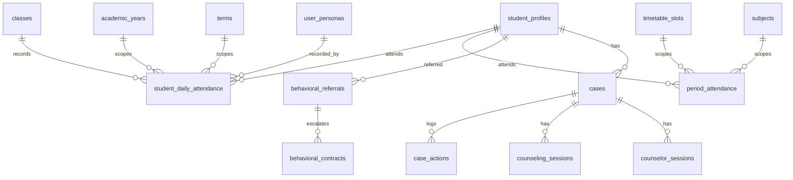

### Workflows / Approvals / Meetings

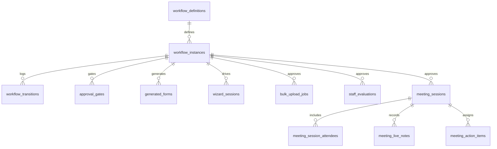

### Staff / HR

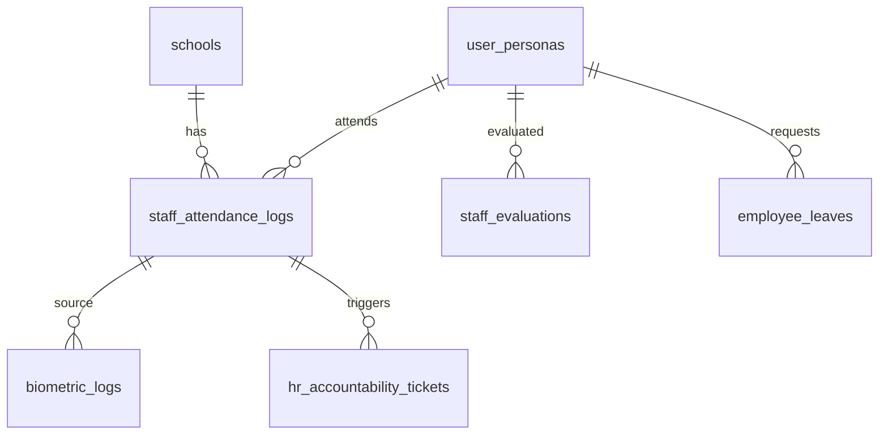

### LRC / Library

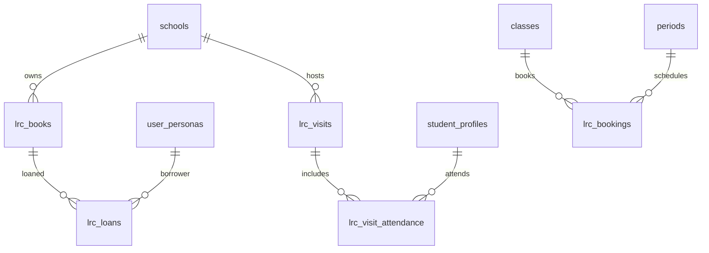

### Health

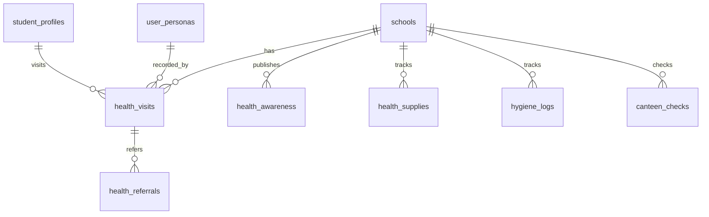

### QA / Quality

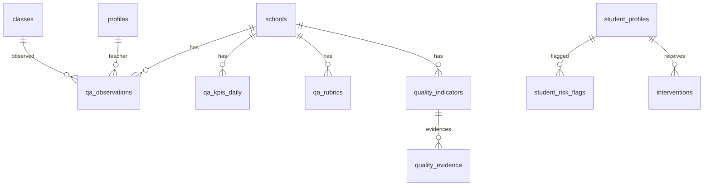

### Activities / Events

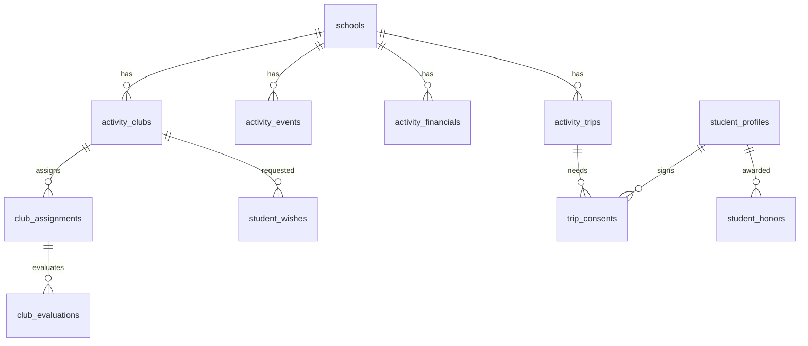

### Notifications / Automation / Analytics / AI

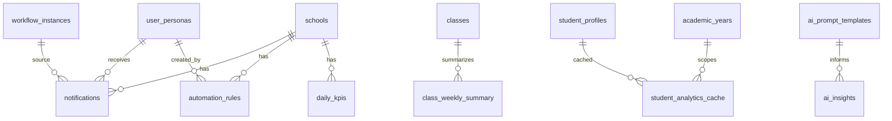

### Gamification / Metaverse

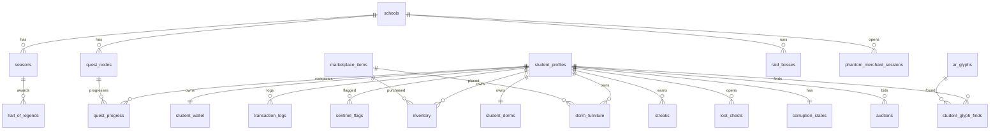

## Trigger Map

| trigger | table | timing | event | function | ماذا يفعل | tables written | security risk | tenant isolation | duplicate/conflict | search_path |
|---|---|---|---|---|---|---|---|---|---|---|
| `on_auth_user_created` | `auth.users` | AFTER | INSERT | `handle_new_user()` | ينشئ profile بعد auth signup | `profiles` | Fatal: يكتب عموداً غير موجود | لا يطبق school context | لا | `public` |
| `enforce_privileged_fields_immutability` | `profiles` | BEFORE | UPDATE | `block_privileged_field_changes()` | يمنع تغيير حقول privileged | none | Fatal: references `role` | غير متعلق | يتداخل مع profile update | `public` |
| `update_profiles_modtime` | `profiles` | BEFORE | UPDATE | `update_modified_column()` | يحدث `updated_at` | same row | منخفض | محايد | لا | غير مؤكد |
| `trg_auto_referral_on_absence` | `student_daily_attendance` | AFTER | INSERT, UPDATE | `fn_auto_referral_on_absence()` | ينشئ referral عند absences | referrals/notifications inferred | High review | يحتاج تحقق كامل | لا | `public` |
| `trg_sda_updated_at` | `student_daily_attendance` | BEFORE | UPDATE | `fn_set_updated_at()` | updated_at | same row | منخفض | محايد | لا | `public` |
| `trg_sync_enrollment` | `student_enrollments` | AFTER | INSERT, UPDATE | `sync_enrollment_to_profile()` | يزامن class/grade إلى `student_profiles` | `student_profiles` | Medium/High | يحتاج `school_id` guard | لا | `public` |
| `update_students_modtime` | `student_profiles` | BEFORE | UPDATE | `update_modified_column()` | updated_at | same row | منخفض | محايد | لا | غير مؤكد |
| `trg_prevent_mln_update` | `meeting_live_notes` | BEFORE | UPDATE | `fn_prevent_mln_update()` | يمنع تعديل notes | none | منخفض | محايد | لا | غير مؤكد |
| `trg_prevent_wft_update` | `workflow_transitions` | BEFORE | UPDATE | `fn_prevent_wft_update()` | يمنع تعديل transitions | none | منخفض | محايد | لا | غير مؤكد |
| `trg_cleanup_idempotency` | `z_archive.action_idempotency` | AFTER | INSERT | `cleanup_expired_idempotency()` | cleanup archive idempotency | archive table | needs review | لا school context | لا | `public` |
| `trg_apt_updated_at` | `ai_prompt_templates` | BEFORE | UPDATE | `fn_set_updated_at()` | updated_at | same row | منخفض | global catalog | لا | `public` |
| `trg_ar_updated_at` | `automation_rules` | BEFORE | UPDATE | `fn_set_updated_at()` | updated_at | same row | منخفض | محايد | لا | `public` |
| `trg_bc_updated_at` | `behavioral_contracts` | BEFORE | UPDATE | `fn_set_updated_at()` | updated_at | same row | منخفض | محايد | لا | `public` |
| `trg_behavioral_referrals_updated_at` | `behavioral_referrals` | BEFORE | UPDATE | `fn_set_updated_at()` | updated_at | same row | منخفض | محايد | لا | `public` |
| `update_cases_modtime` | `cases` | BEFORE | UPDATE | `update_modified_column()` | updated_at | same row | منخفض | محايد | لا | غير مؤكد |
| `trg_hs_updated_at` | `health_supplies` | BEFORE | UPDATE | `fn_set_updated_at()` | updated_at | same row | منخفض | محايد | لا | `public` |
| `trg_int_updated_at` | `interventions` | BEFORE | UPDATE | `fn_set_updated_at()` | updated_at | same row | منخفض | محايد | لا | `public` |
| `update_lab_inventory_modtime` | `lab_inventory` | BEFORE | UPDATE | `update_modified_column()` | updated_at | same row | منخفض | محايد | لا | غير مؤكد |
| `trg_ll_updated_at` | `lrc_loans` | BEFORE | UPDATE | `fn_set_updated_at()` | updated_at | same row | منخفض | محايد | لا | `public` |
| `trg_qar_updated_at` | `qa_rubrics` | BEFORE | UPDATE | `fn_set_updated_at()` | updated_at | same row | منخفض | محايد | لا | `public` |
| `update_correspondence_modtime` | `secretary_correspondence` | BEFORE | UPDATE | `update_modified_column()` | updated_at | same row | منخفض | محايد | لا | غير مؤكد |
| `trg_sal_updated_at` | `staff_attendance_logs` | BEFORE | UPDATE | `fn_sal_set_updated_at()` | updated_at | same row | منخفض | محايد | لا | `public` |
| `trg_sa_updated_at` | `student_assets` | BEFORE | UPDATE | `fn_set_updated_at()` | updated_at | same row | منخفض | محايد | لا | `public` |
| `update_dorm_modtime` | `student_dorms` | BEFORE | UPDATE | `update_modified_column()` | updated_at | same row | منخفض | محايد | لا | غير مؤكد |
| `update_wallet_modtime` | `student_wallet` | BEFORE | UPDATE | `update_modified_column()` | updated_at | same row | منخفض | محايد | لا | غير مؤكد |

### Trigger Flow

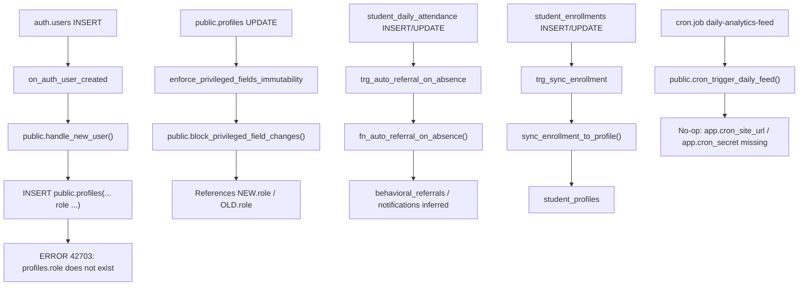

## Function / RPC Audit

| function | security | search_path | execute privileges | reads JWT/Auth | uses `school_id` | mutation | leakage risk | status |
|---|---|---|---|---|---|---|---|---|
| `public.get_my_school_id()` | `SECURITY DEFINER` | `public` | `authenticated` | `auth.jwt()` | returns JWT `school_id` | no | medium due exposure | needs review |
| `public.get_my_role()` | `SECURITY DEFINER` | `public` | `authenticated` | `auth.uid()` | no | no | high | dangerous/dead |
| `public.is_system_owner()` | `SECURITY DEFINER` | `public` | `authenticated` | `auth.uid()` | no | no | high intentional bypass | needs hardening |
| `public.handle_new_user()` | `SECURITY DEFINER` | `public` | trigger only | `NEW` auth row | no | writes `profiles` | fatal runtime | fatal |
| `public.block_privileged_field_changes()` | `SECURITY DEFINER` | `public` | trigger only | unknown | no | no | fatal runtime | fatal |
| `public.close_expired_invites(text, uuid)` | `SECURITY DEFINER` | `public` | `authenticated` | no direct | `p_school` | mutates invites | high | needs review |
| `public.rpc_process_transaction(...)` | `SECURITY DEFINER` | `public` | `authenticated` | no direct | no verified tenant guard | writes wallet/logs/config | fatal | dangerous |
| `public.rpc_purchase_furniture(uuid)` | `SECURITY DEFINER` | `public` | `authenticated` | `auth.uid()` likely | no | writes inventory/dorm/logs | high/fatal | legacy |
| `public.rpc_purchase_furniture(uuid, uuid)` | `SECURITY DEFINER` | `public` | `anon`, `authenticated`, broad roles | unclear | uses `get_my_school_id()` | writes | high/fatal | dangerous |
| `public.rpc_scan_ar_glyph(text)` | `SECURITY DEFINER` | `public` | `authenticated` | `auth.uid()` likely | no | writes glyph finds/ledger | high/fatal | legacy |
| `public.rpc_scan_ar_glyph(text, uuid)` | `SECURITY DEFINER` | `public` | `anon`, `authenticated`, broad roles | unclear | uses `get_my_school_id()` | writes | high/fatal | dangerous |
| `public.rpc_reconcile_wallets()` | `SECURITY DEFINER` | `public` | privileged only | no | no | writes sentinel flags | medium/high if invoked | needs review |
| `public.cleanup_old_rate_limits()` | `SECURITY DEFINER` | `public` | privileged only | no | no | deletes old rows | dead: table missing | dead |
| `public.archive_old_audit_logs()` | `SECURITY DEFINER` | `public` | privileged only | no | unknown | mutates archive | medium | needs review |
| `public.cron_trigger_daily_feed()` | `SECURITY DEFINER` | `public` | privileged only | no | no | calls HTTP/cron | no-op due settings | needs config |
| `public.fn_auto_referral_on_absence()` | `SECURITY DEFINER` | `public` | trigger only | no direct | likely uses row `school_id` | writes referrals | high review | needs review |
| `public.cleanup_expired_idempotency()` | invoker | `public` | broad by default | no | no | cleanup | low/medium | needs grants review |
| `public.fn_check_absence()` | invoker | `public` | broad by default | no | no | references old logic | dead | dead |
| `public.fn_generate_procurement_number()` | invoker | `public` | broad by default | no | no | helper | obsolete if table missing | legacy |
| `public.sync_enrollment_to_profile()` | invoker | `public` | broad by default | no | through row only | updates student_profiles | medium/high | needs tenant guard |

## RLS Matrix: Who Sees What

Symbols:

- `👁` view
- `➕` create
- `✏️` update
- `🗑` delete
- `❌` no access
- `⚠️` unclear / policy ambiguous

| module | system_owner | school_admin | school_principal | school_librarian | student_affairs_vp | academic_vp | school_affairs_vp | school_secretary | activity_leader | student_counselor | student | parent | teacher | health_coordinator | quality_coordinator | lab_technician |
|---|---|---|---|---|---|---|---|---|---|---|---|---|---|---|---|---|
| Core identity | 👁➕✏️🗑 | ⚠️ | ⚠️ | ⚠️ | ⚠️ | ⚠️ | ⚠️ | ⚠️ | ⚠️ | ⚠️ | 👁✏️ own | 👁✏️ own | 👁✏️ own | ⚠️ | ⚠️ | ⚠️ |
| Academic | 👁➕✏️🗑 | 👁➕✏️ | 👁➕✏️ | 👁 | 👁 | 👁➕✏️ | 👁 | 👁➕✏️ | ❌ | 👁 | ❌ | ❌ | 👁 | ❌ | 👁 | ❌ |
| Students | 👁➕✏️ | 👁➕✏️ | 👁➕✏️ | ❌ | 👁➕✏️ | 👁 | 👁 | 👁➕✏️ | ⚠️ | 👁 | ⚠️ | ⚠️ | 👁✏️ | 👁 | 👁 | ❌ |
| Attendance | 👁➕✏️ | 👁➕✏️ | 👁➕✏️ | ❌ | 👁➕✏️ | 👁 | 👁 | 👁➕✏️ | ❌ | 👁 | ❌ | ❌ | 👁➕✏️ | 👁 | 👁 | ❌ |
| Workflows | 👁➕✏️ | 👁➕✏️ | 👁➕✏️ | ⚠️ | ⚠️ | ⚠️ | ⚠️ | ⚠️ | ⚠️ | ⚠️ | ❌ | ❌ | ⚠️ | ⚠️ | ⚠️ | ⚠️ |
| LRC | 👁➕✏️ | 👁 | 👁 | 👁➕✏️ | ❌ | ❌ | ❌ | 👁 | ❌ | ❌ | ❌ | ❌ | ⚠️ | ❌ | ❌ | ❌ |
| Health | 👁➕✏️ | 👁 | 👁 | ❌ | 👁 | ❌ | ❌ | 👁 | ❌ | 👁 | ❌ | ❌ | ❌ | 👁➕✏️ | 👁 | ❌ |
| QA/Quality | 👁➕✏️ | 👁 | 👁 | ❌ | 👁 | 👁 | 👁 | ❌ | ❌ | 👁 | ❌ | ❌ | 👁 | ❌ | 👁➕✏️ | ❌ |
| Activities | 👁➕✏️ | 👁 | 👁 | ❌ | 👁 | ❌ | ❌ | 👁 | 👁➕✏️ | ❌ | ⚠️ | ⚠️ | ⚠️ | ❌ | ❌ | ❌ |
| Notifications | 👁➕✏️ | ⚠️ | ⚠️ | ⚠️ | ⚠️ | ⚠️ | ⚠️ | ⚠️ | ⚠️ | ⚠️ | ⚠️ | ⚠️ | ⚠️ | ⚠️ | ⚠️ | ⚠️ |
| Analytics/AI | 👁➕✏️ | 👁 | 👁 | ❌ | 👁 | 👁 | 👁 | ❌ | ❌ | 👁 | ❌ | ❌ | 👁 | ❌ | 👁 | ❌ |
| Gamification | 👁➕✏️🗑 | ⚠️ | ⚠️ | ❌ | ⚠️ | ❌ | ❌ | ❌ | ⚠️ | ❌ | ⚠️ RPC | ❌ | ❌ | ❌ | ❌ | ❌ |

أخطر الصلاحيات المفاجئة:

- `teacher` يستطيع `UPDATE student_profiles` حسب policy `sp_update`.
- `workflow_definitions` مفتوح لكل `authenticated` عبر `USING (true)`.
- `student_honors` و`student_wishes` يستخدمان شرط `student_id = auth.uid()` رغم أن `student_id` FK إلى `student_profiles`.
- RPCs الخاصة بالـgamification قابلة للتنفيذ من `anon/authenticated` في live.
- grants الواسعة تجعل GraphQL يرى معظم public tables.

## Dead Tables / Blind Code / Orphaned Architecture

### جداول أو RPCs مفقودة حياً ومستخدمة في التطبيق

| missing object | evidence | replacement / note |
|---|---|---|
| `rate_limit_tracker` | `lib/rate-limiter.ts` | local migration أنشأها لكن live missing |
| `increment_rate_limit` | `lib/rate-limiter.ts` | RPC missing |
| `system_config` | `lib/metaverse/ledger.ts`, `app/principal/analytics/_components/SentinelDashboard.tsx` | `rpc_process_transaction` يعتمد عليها |
| `students` | `app/counselor/_hooks/useCounselor.ts` fallback | يجب استخدام `student_profiles` |
| `student_attendance` | `app/student-affairs/_hooks/useStudentAffairs.ts`, legacy refs | replacement: `student_daily_attendance` |
| `attendance_logs` | `app/secretary/_actions.ts`, `app/secretary/_hooks/useSecretary.ts` | replacement: `staff_attendance_logs` |
| `hr_inquiries` | `app/secretary/_actions.ts`, `app/secretary/_hooks/useSecretary.ts` | replacement: `hr_accountability_tickets` |
| `meetings` | `app/secretary/_actions.ts`, `app/secretary/_hooks/useSecretary.ts` | replacement: `meeting_sessions` |
| `meeting_attendees` | `app/secretary/_actions.ts` | replacement: `meeting_session_attendees` |
| `procurement_requests` | `app/secretary/_actions.ts` | missing/live-dead |
| `assignment_letters` | `app/secretary/_actions.ts` | missing/live-dead |
| `cleaning_reports` | `app/classroom/_actions.ts` | missing/live-dead |

### أدلة من migrations

`db/migrations/20260529_r01_drop_legacy_tables.sql` يحذف legacy tables:

```text
employees
attendance_logs
hr_inquiries
meetings
meeting_attendees
assignment_letters
procurement_requests
student_attendance
```

لكن app code لا يزال يستدعي بعضها.

### Mock / fake UI غير مؤكد

- وجود صفحات تعمل على جداول مفقودة يعني UI قد يبدو مكتملًا لكنه غير موصول فعلياً.
- غير مؤكد: كل mock data داخل components لم يتم audit كاملاً بAST.

## Live DB vs Local Migrations Diff

| المحور | live | local | الحكم |
|---|---|---|---|
| migration history | ترحيلان فقط | 80 SQL files | Fatal drift |
| Edge Functions | `[]` | `supabase/functions/daily-feed/index.ts` | غير deployed |
| cron | `daily-analytics-feed` active | `20260602_pg_cron_daily_feed.sql` | no-op بسبب settings |
| `system_config` | missing | created in `20260121_ledger_hardening.sql` | drift/fatal |
| `rate_limit_tracker` | missing | created in `20260130_action_audit_log.sql` | drift/runtime bug |
| old RPC overloads | موجودة | migrations لاحقة حاولت harden/revoke | drift/security bug |
| `user_role` enum | موجود بقيم legacy | migrations تحاول normalize/drop | cleanup incomplete |
| legacy app refs | موجودة في app | migration حذف الجداول | app/schema mismatch |
| storage buckets | none | none found relevant | OK |
| RLS | enabled public | expected | enabled لا يعني آمن |

أمثلة local-only أو expected-but-missing:

- `public.system_config`
- `public.rate_limit_tracker`
- `public.increment_rate_limit`
- deployed `daily-feed` Edge Function

أمثلة live-only أو stale:

- `public.user_role` enum بقيم legacy.
- `public.rpc_scan_ar_glyph(glyph_hash text)`.
- `public.rpc_purchase_furniture(p_item_id uuid)`.
- grants لـ`anon` على RPC overloads الجديدة.

## Security Checklist

| check | النتيجة | الحكم |
|---|---|---|
| RLS disabled tables في `public` | 0 | pass شكلي |
| RLS disabled tables في `z_archive` | `z_archive.qa_rubrics` | needs review |
| RLS enabled no policy | `z_archive.import_runs`, `z_archive.import_run_items` | low/medium |
| tenant tables بلا `school_id` | `case_actions`, `student_honors`, `student_wishes`, `invites` | high/fatal حسب usage |
| `school_id nullable` | 10 tables | fatal before launch |
| `USING (true)` | `workflow_definitions` | needs review |
| banned helpers in live policies | لم تظهر exact matches لـ`auth_school_id`, `auth_role_key`, `is_admin`, `is_super_admin` | pass جزئي |
| legacy roles in live enum | `user_role` contains legacy names | high |
| anon RPC access | `rpc_scan_ar_glyph(text, uuid)`, `rpc_purchase_furniture(uuid, uuid)` | high/fatal |
| authenticated SECURITY DEFINER | multiple | high |
| mutable search_path | key functions set `search_path=public`; still exposed schema | high if callable |
| storage buckets | none | pass |
| invitation exposure | `invites.target_school_id`, `target_role user_role` | high cleanup |
| parent/student boundaries | غير مؤكدة بالكامل؛ policies خاطئة في wishes/honors | high |
| system_owner bypass | موجود عبر `is_system_owner()` وJWT role | needs documentation/hardening |
| cross-school analytics leakage | caches have `school_id`, but index/RLS hardening needed | medium |
| notification leakage | RLS موجود، لكن GraphQL grants واسعة | medium/high |
| workflow leakage | `workflow_definitions USING true` | high review |
| `pg_net` in `public` | advisor warning | high cleanup |

## Performance / Index Audit

### Findings

| finding | count / object | الأثر |
|---|---:|---|
| unindexed foreign keys | 125 | بطء joins/deletes/RLS lookups |
| tenant tables missing leftmost `school_id` index | 13 | بطء RLS predicates |
| duplicate index | 1 | write overhead |
| multiple permissive policies | multiple gamification/core tables | overhead في RLS evaluation |

### Tenant tables بلا leftmost `school_id` index

```text
activity_trips
classes
club_assignments
club_evaluations
corruption_states
dorm_furniture
guardians
hall_of_legends
meeting_session_attendees
parent_reports
student_dorms
student_guardians
trip_consents
```

### Duplicate Index

```sql
CREATE INDEX idx_student_profiles_national_id ON public.student_profiles USING btree (national_id);
CREATE INDEX idx_students_national_id ON public.student_profiles USING btree (national_id);
```

### FK samples بلا covering index

```text
activity_financials_created_by_fkey
activity_trips_school_id_fkey
ai_insights_academic_year_id_fkey
approval_gates_decided_by_persona_id_fkey
fk_ag_instance
attendance_scans_academic_year_id_fkey
auctions_bidder_id_fkey
automation_rules_created_by_fkey
behavioral_contracts_academic_year_id_fkey
behavioral_contracts_referral_id_fkey
behavioral_contracts_vp_persona_id_fkey
biometric_logs_attendance_log_id_fkey
bulk_upload_jobs_approved_by_persona_id_fkey
bulk_upload_jobs_workflow_instance_id_fkey
canteen_checks_inspector_persona_id_fkey
case_actions_actor_id_fkey
cases_academic_year_id_fkey
cases_opened_by_fkey
class_weekly_summary_academic_year_id_fkey
class_weekly_summary_class_id_fkey
classroom_exits_timetable_slot_id_fkey
club_assignments_school_id_fkey
club_assignments_teacher_id_fkey
club_evaluations_assignment_id_fkey
club_evaluations_school_id_fkey
```

## Recommended Fix Plan

### Phase 1: Fatal Launch Blockers

| priority | target | risk | migration name | validation | acceptance criteria |
|---|---|---|---|---|---|
| P0 | `public.handle_new_user()` + auth trigger | signup fails | `20260604_fix_auth_profile_provisioning.sql` | signup/onboarding test | no references to `profiles.role` |
| P0 | `public.block_privileged_field_changes()` | profile update fails | `20260604_fix_profile_privileged_fields_trigger.sql` | update profile test | trigger uses `system_role/default_persona_id` only |
| P0 | migration history | source of truth broken | `20260604_rebuild_prelaunch_baseline.sql` or reset/apply | `supabase migration list` | live migrations match local |
| P0 | RPC overloads | anon/auth mutation | `20260604_harden_rpc_surface.sql` | advisor 0028/0029 | no anon SECURITY DEFINER |
| P0 | missing `system_config/rate_limit_tracker` contract | runtime errors | `20260604_restore_or_remove_runtime_contracts.sql` | `rg` + live object check | app references resolve |
| P0 | nullable `school_id` | tenant isolation | `20260604_enforce_tenant_not_null.sql` | nullable query = 0 | no nullable tenant `school_id` |

### Phase 2: Security Hardening

| priority | target | migration name | validation | acceptance criteria |
|---|---|---|---|---|
| P1 | revoke broad `EXECUTE` on definer functions | `20260605_lockdown_function_grants.sql` | advisor 0028/0029 | clean or justified |
| P1 | move helper functions to private schema where possible | `20260605_private_auth_helpers.sql` | function grants query | not exposed via REST/RPC |
| P1 | GraphQL/table grants | `20260605_lockdown_api_table_grants.sql` | advisor 0027 | only intended tables visible |
| P1 | `pg_net` location | `20260605_move_pg_net_out_of_public.sql` | extension query | no extension in `public` |
| P1 | `workflow_definitions` policy | `20260605_harden_workflow_definitions_rls.sql` | policy query | no unjustified `USING true` |

### Phase 3: Schema Cleanup

| priority | target | migration name | validation | acceptance criteria |
|---|---|---|---|---|
| P1 | `invites` role type | `20260605_rebuild_invites_role_contract.sql` | enum/policy query | no `user_role` dependency |
| P1 | `case_actions` | `20260605_tenant_case_actions.sql` | columns/constraints query | has `school_id NOT NULL` |
| P1 | `student_honors`, `student_wishes` | `20260605_tenant_activity_student_tables.sql` | RLS tests | school-scoped and app writes pass |
| P2 | duplicate indexes | `20260606_cleanup_duplicate_indexes.sql` | advisor duplicate index | no duplicate indexes |
| P2 | `z_archive` | `20260606_lockdown_archive_schema.sql` | advisor | archive risks documented or fixed |

### Phase 4: App / Service Alignment

| priority | target files | action | validation |
|---|---|---|---|
| P0 | `lib/rate-limiter.ts` | align with live rate limit contract | no missing RPC/table |
| P0 | `lib/metaverse/ledger.ts`, `lib/metaverse/sync-engine.ts` | update RPC signatures and tenant contract | runtime RPC tests |
| P0 | `app/secretary/_actions.ts`, `app/secretary/_hooks/useSecretary.ts` | replace legacy tables | `rg` legacy names = 0 |
| P0 | `app/classroom/_actions.ts` | remove/replace `cleaning_reports` | route action test |
| P1 | `app/activity/_actions.ts`, `app/activity/_hooks/useActivities.ts` | align `student_honors/wishes` RLS | insert/upsert tests |
| P1 | `app/qa/_hooks/useQA.ts` | replace `students(name)` joins with `student_profiles(name)` | data load test |
| P1 | `app/admin/timetable/page.tsx`, `app/lrc/_hooks/useLRC.ts` | remove `profiles.role` references | `rg "profiles.*role"` review |

### Phase 5: Documentation / ERD Finalization

| priority | target | action | acceptance criteria |
|---|---|---|---|
| P2 | `db/README.md` | update authoritative DB map | matches live after rebuild |
| P2 | `docs/audits/` | preserve audit trail | includes remediation status |
| P2 | ERD docs | publish domain ERDs | reflects actual FKs |
| P2 | RLS docs | document role/table matrix | every policy mapped to role intent |

## Validation SQL / Commands

هذه أمثلة تحقق قراءة فقط أو commands محلية. لا تنفذ migrations بدون قرار منفصل.

### تحقق `profiles.role`

```sql
select column_name, data_type, udt_name
from information_schema.columns
where table_schema='public' and table_name='profiles'
order by ordinal_position;
```

### تحقق trigger

```sql
select t.tgname,
       pg_get_triggerdef(t.oid, true),
       pg_get_functiondef(p.oid)
from pg_trigger t
join pg_proc p on p.oid = t.tgfoid
join pg_class c on c.oid = t.tgrelid
join pg_namespace n on n.oid = c.relnamespace
where n.nspname='auth'
  and c.relname='users'
  and t.tgname='on_auth_user_created';
```

### تحقق جداول `school_id nullable`

```sql
select table_name
from information_schema.columns
where table_schema='public'
  and column_name='school_id'
  and is_nullable='YES'
order by table_name;
```

### تحقق جداول بلا `school_id`

```sql
select t.table_name
from information_schema.tables t
where t.table_schema='public'
  and t.table_type='BASE TABLE'
  and not exists (
    select 1
    from information_schema.columns c
    where c.table_schema=t.table_schema
      and c.table_name=t.table_name
      and c.column_name='school_id'
  )
order by t.table_name;
```

### تحقق `SECURITY DEFINER` exposed functions

```sql
select n.nspname as schema_name,
       p.proname,
       pg_get_function_identity_arguments(p.oid) as args,
       p.prosecdef,
       p.proconfig
from pg_proc p
join pg_namespace n on n.oid=p.pronamespace
where n.nspname='public'
  and p.prosecdef
order by p.proname, args;
```

### تحقق app blind code

```powershell
rg -n -F -e "rate_limit_tracker" -e "increment_rate_limit" -e "system_config" -e "student_attendance" -e "attendance_logs" -e "hr_inquiries" -e "meetings" -e "meeting_attendees" -e "procurement_requests" -e "assignment_letters" -e "cleaning_reports" app lib
```

## المراجع

- Supabase RLS docs: https://supabase.com/docs/guides/database/postgres/row-level-security
- Supabase advisor 0028: https://supabase.com/docs/guides/database/database-linter?lint=0028_anon_security_definer_function_executable
- Supabase advisor 0029: https://supabase.com/docs/guides/database/database-linter?lint=0029_authenticated_security_definer_function_executable
- Supabase advisor 0014: https://supabase.com/docs/guides/database/database-linter?lint=0014_extension_in_public
- Supabase advisor 0027: https://supabase.com/docs/guides/database/database-linter?lint=0027_pg_graphql_authenticated_table_exposed
- Supabase advisor 0001: https://supabase.com/docs/guides/database/database-linter?lint=0001_unindexed_foreign_keys
- Supabase advisor 0006: https://supabase.com/docs/guides/database/database-linter?lint=0006_multiple_permissive_policies
- Supabase advisor 0009: https://supabase.com/docs/guides/database/database-linter?lint=0009_duplicate_index
